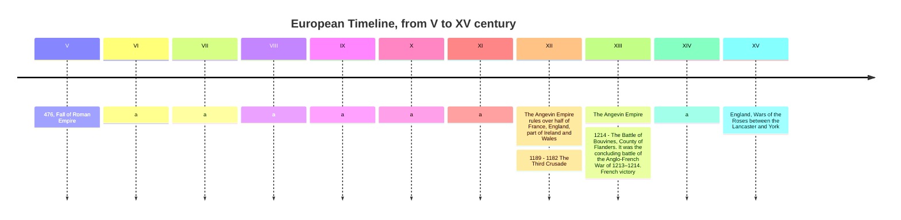
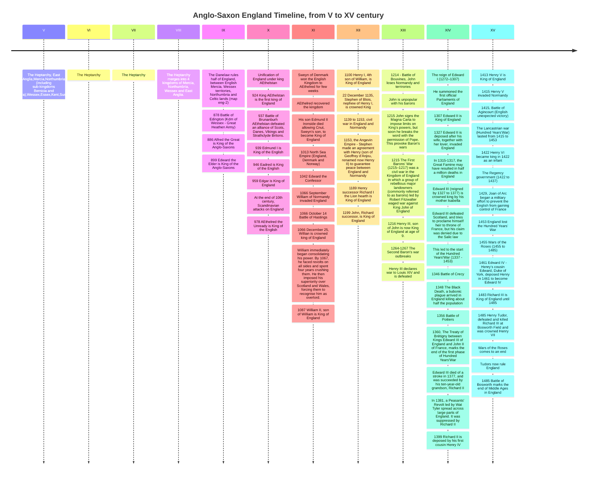

# European Middle Ages timelines

```mermaid
timeline
    title European Timeline, from V to XV century
        V : 476, Fall of Roman Empire
        VI : a
        VII : a
        VIII : a
        IX : a
        X : a
        XI : a
        XII : The Angevin Empire rules over half of France, England, part of Ireland and Wales : 1189 - 1182 The Third Crusade
        XIII : The Angevin Empire : 1214 - The Battle of Bouvines, County of Flanders. It was the concluding battle of the Anglo-French War of 1213–1214. French victory
        XIV : a
        XV : England, Wars of the Roses between the Lancaster and York
```

```mermaid
timeline
    title Anglo-Saxon England Timeline, from V to XV century
        V : The Heptarchy, East Anglia,Mercia,Northumbria (including sub-kingdoms Bernicia and Deira),Wessex,Essex,Kent,Sussex
        VI : The Heptarchy
        VII : The Heptarchy
        VIII : The Heptarchy merges into 4 kingdoms of Mercia, Northumbria, Wessex and East Anglia. 
        IX : The Danelaw rules half of England, between English Mercia, Wessex territories, Northumbria and Celtic lands (map eng-2) : 878 Battle of Edington (Kdm of Wessex - Great Heathen Army) : 886 Alfred the Great is King of the Anglo-Saxons : 899 Edward the Elder is King of the Anglo-Saxons
        X : Unification of England under king AEthelstan : 924 King AEthelstan is the first king of England : 937 Battle of Brunanburh AEthelstan defeated an alliance of Scots, Danes, Vikings and Strathclyde Britons. : 939 Edmund I is King of the English : 946 Eadred is King of the English : 959 Edgar is King of England : At the end of 10th century, Scandinavian attacks on England : 978 AEthelred the Unready is King of the English
        XI : Sweyn of Denmark won the English Kingdom to AEthelred for few weeks : AEthelred recovered the kingdom : His son Edmund II Ironside died allowing Cnut, Sweyn's son, to become King of England : 1013 North Sea Empire (England, Denmark and Norway) : 1042 Edward the Confessor : 1066 September William of Normandy invaded England : 1066 October 14 Battle of Hastings : 1066 December 25, Willian is crowned king of England : William immediately began consolidating his power. By 1067, he faced revolts on all sides and spent four years crushing them. He then imposed his superiority over Scotland and Wales, forcing them to recognise him as overlord. : 1087 William II, son of William is King of England
        XII : 1100 Henry I, 4th son of William, is King of England : 22 December 1135, Stephen of Blois, nephew of Henry I, is crowned King : 1139 to 1153, civil war in England and Normandy : 1153, the Angevin Empire - Stephen made an agreement with Henry (son of Geoffrey d'Anjou, renamed now Henry II) to guarantee peace between England and Normandy : 1189 Henry successor Richard I the Lion hearth is King of England : 1199 John, Richard successor, is King of England
        XIII : 1214 - Battle of Bouvines, John loses Normandy and terrirories : John is unpopular with his barons : 1215 John signs the Magna Carta to impose limits on King's powers, but soon he breaks the word with the permission of Pope. This provoke Baron's wars : 1215 The First Barons' War (1215–1217) was a civil war in the Kingdom of England in which a group of rebellious major landowners (commonly referred to as barons) led by Robert Fitzwalter waged war against King John of England : 1216 Henry III, son of John is now King of England at age of 9. : 1264-1267 The Second Baron's war outbreaks : Henry III declares war to Louis XIV and is defeated
        XIV : The reign of Edward I (1272–1307) : He summoned the first official Parliaments of England : 1307 Edward II is King of England : 1327 Edward II is deposed after his wife, together with her lover, invaded England : In 1315-1317, the Great Famine may have resulted in half a million deaths in England : Edward III (reigned by 1327 to 1377) is crowned king by his mother Isabella : Edward III defeated Scotland, and tries to proclame himself heir to throne of France, but his claim was denied due to the Salic law : This led to the start of the Hundred Years'War (1337 - 1453) : 1346 Battle of Crecy : 1348 The Black Death, a bubonic plague arrived in England killing about half the population : 1356 Battle of Poitiers : 1360, The Treaty of Brétigny between Kings Edward III of England and John II of France, marks the end of the first phase of Hundred Years'War : Edward III died of a stroke in 1377, and was succeeded by his ten-year-old grandson, Richard II : In 1381, a Peasants' Revolt led by Wat Tyler spread across large parts of England. It was suppressed by Richard II : 1399 Richard II is deposed by his first cousin Henry IV
        XV : 1413 Henry V is King of England : 1415 Henry V invaded Normandy : 1415, Battle of Agincourt (English unexpected victory) : The Lancastrian war (Hundred Years'War) lasted from 1415 to 1453 : 1422 Henry VI became king in 1422 as an infant : The Regency government (1422 to 1437) : 1429, Joan of Arc began a military effort to prevent the English from gaining control of France : 1453 England lost the Hundred Years' War : 1455 Wars of the Roses (1455 to 1485) : 1461 Edward IV - Henry's cousin Edward, Duke of York, deposed Henry in 1461 to become Edward IV : 1483 Richard III is King of England until 1485 : 1485 Henry Tudor, defeated and killed Richard III at Bosworth Field and was crowned Henry VII : Wars of the Roses comes to an end : Tudors now rule England : 1485 Battle of Bosworth marks the end of Middle Ages in England

```